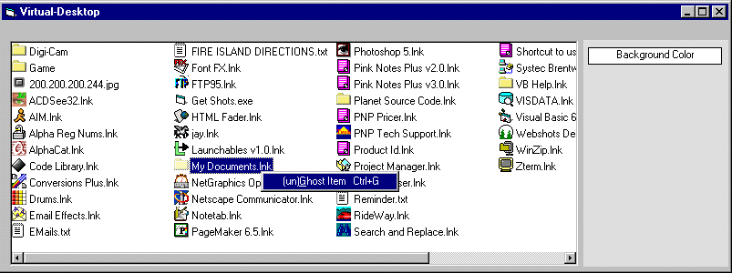



## Virtual Desktop

### Description

I was looking for some code to re-create a users Desktop into a listview control with all their correct icons.

*** This doesnt work in Windows2000. Because there is no ONE desktop ***

Please Vote :)
 
### More Info
 

             |
---                |---
**Submitted On**   |2000-08-25 14:43:32
**By**             |[Sparq](https://github.com/Planet-Source-Code/PSCIndex/blob/master/ByAuthor/sparq.md)
**Level**          |Intermediate
**User Rating**    |3.7 (11 globes from 3 users)
**Compatibility**  |VB 6\.0
**Category**       |[Complete Applications](https://github.com/Planet-Source-Code/PSCIndex/blob/master/ByCategory/complete-applications__1-27.md)
**World**          |[Visual Basic](https://github.com/Planet-Source-Code/PSCIndex/blob/master/ByWorld/visual-basic.md)
**Archive File**   |[CODE\_UPLOAD93098252000\.zip](https://github.com/Planet-Source-Code/sparq-virtual-desktop__1-11004/archive/master.zip)

